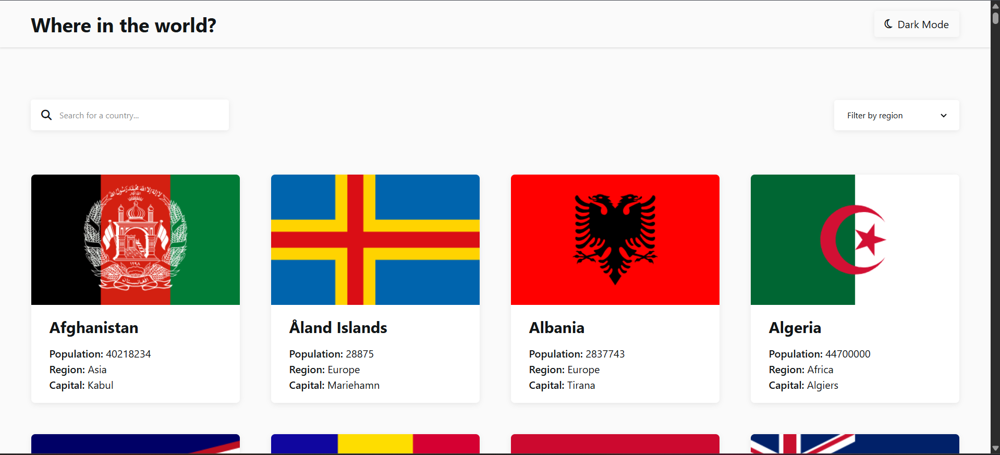

# REST Countries API with color theme switcher solution

This is a solution to the [REST Countries API with color theme switcher challenge on Frontend Mentor](https://www.frontendmentor.io/challenges/rest-countries-api-with-color-theme-switcher-5cacc469fec04111f7b848ca).  

## Table of contents

- [Overview](#overview)
  - [The challenge](#the-challenge)
  - [Screenshot](#screenshot)
  - [Links](#links)
- [Author](#author)

## Overview

### The challenge

Users should be able to:

- See all countries from the API on the homepage
- Search for a country using an `input` field
- Filter countries by region
- Click on a country to see more detailed information on a separate page
- Click through to the border countries on the detail page
- Toggle the color scheme between light and dark mode 

### Screenshot

### Links

- Solution URL: [solution URL](https://github.com/IndranjanaChatterjee/REST-Countries-API-with-color-theme-switcher)
- Live Site URL: [live site](https://rest-countries-api-with-color-theme-black.vercel.app/)

## My process

### Built with

- Semantic HTML5 markup
- CSS custom properties
- Flexbox
- CSS Grid
- Mobile-first workflow
- [Angular](https://angular.dev/)
- [Docker](https://docs.docker.com/)
- [Tailwind Css](https://tailwindcss.com/)

## Author

- Website - [Indranjana Chatterjee](https://www.indranjanachatterjee.me/)
- Frontend Mentor - [@yourusername](https://www.frontendmentor.io/profile/IndranjanaChatterjee)

